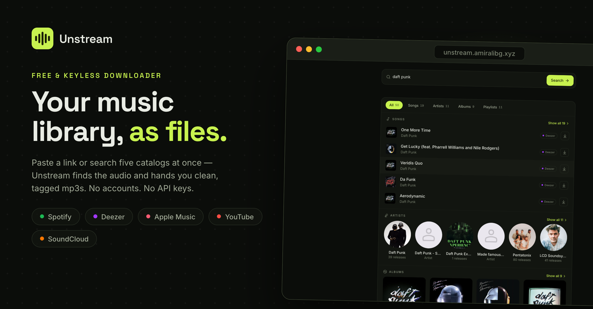
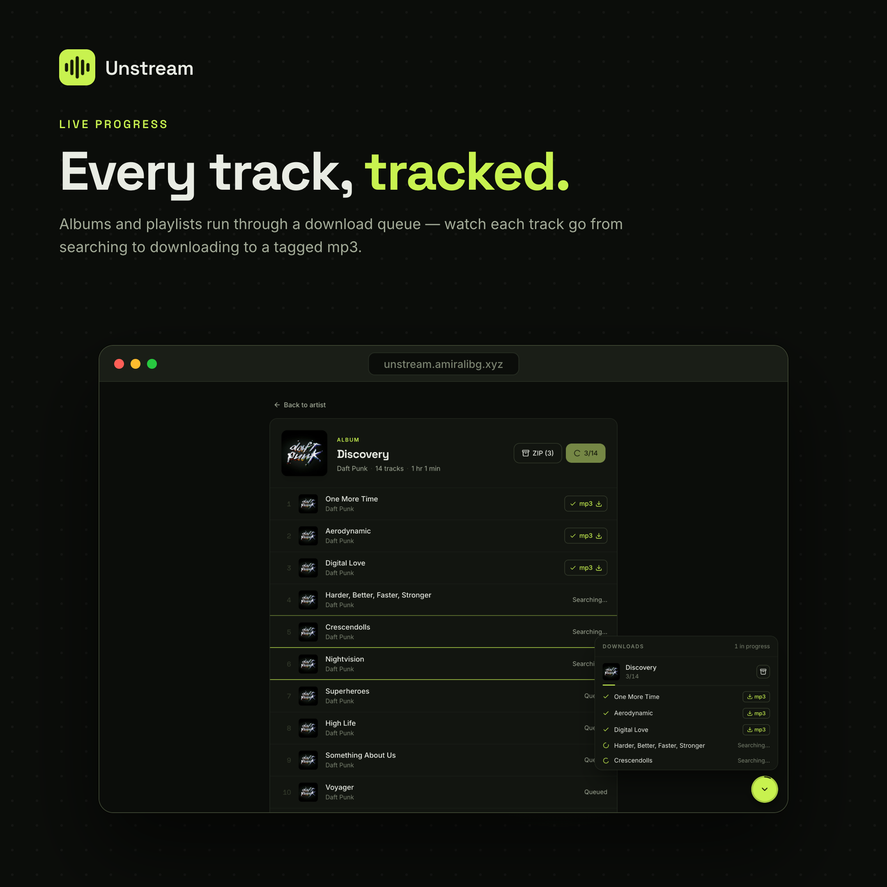
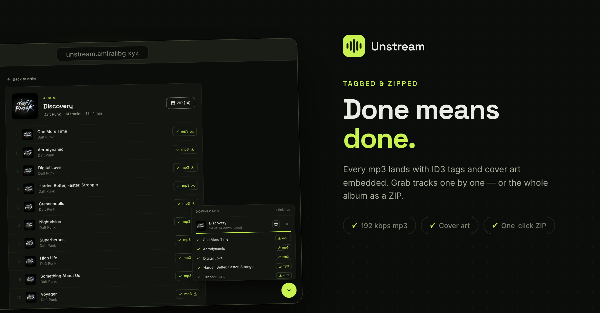

<p align="center">
  
</p>

<h1 align="center">Unstream</h1>

<p align="center">
  
</p>

Educational project: paste a **Spotify / Deezer / Apple Music / YouTube / SoundCloud** track, album or playlist URL — or search every catalog at once — and get tagged audio files at the quality you pick (128 / 192 / 320 kbps mp3, or the original stream untouched). No accounts, no API keys, nothing paid.

<table>
  <tr>
    <td width="50%"></td>
    <td width="50%"></td>
  </tr>
</table>

## How it actually works

Streaming services are DRM-protected, so nothing is downloaded from them directly. Instead:

1. **Metadata** comes from free, keyless providers:
   - **Spotify embed pages** (`open.spotify.com/embed/…`) — the public iframe widget ships full track lists as JSON; this is how most downloader websites work. Used for pasted Spotify URLs.
   - **Deezer public API** — keyless; powers search (songs, albums, **artists**, playlists), full artist discographies, and Deezer URLs.
   - **iTunes Search API** — keyless; adds Apple Music coverage to search and resolves `music.apple.com` URLs.
   - **SoundCloud web API** — the site's own `api-v2` endpoints, using a client id scraped from its public JS bundles (the same trick yt-dlp uses). Full search parity with soundcloud.com: tracks, people, albums and playlists; artist profiles resolve to their complete uploads. Go-only (DRM) tracks are filtered out.
   - **yt-dlp** — reads public YouTube and SoundCloud pages; resolves their URLs (videos, playlists, sets, profiles) and contributes YouTube search results.
   Search fans out to all of these in parallel and merges the results, deduped by name + artist. There is deliberately no Spotify Web API integration — since 2025 it requires the app owner to hold an active Premium subscription, and this project stays 100% free and keyless.
2. **yt-dlp** finds the audio: tracks that already point at a YouTube/SoundCloud page download directly; everything else is searched (`ytsearch8:` on "artists - title") picking the result whose duration is closest to the catalog's (rejects live versions and hour-long mixes). Retries exclude broken uploads, and the last attempt searches SoundCloud instead of YouTube.
3. The best audio stream is downloaded at the **quality** picked in the header — **ffmpeg** encodes mp3 at 128, 192 (default) or 320 kbps; if the converter leaves raw audio behind, a direct ffmpeg pass salvages it. **Original** skips the encode and keeps the upload's own stream (m4a, or opus remuxed out of webm so it can carry tags) — best fidelity, since re-encoding an already-lossy source can only lose more.
4. **mutagen** embeds tags + cover art into the file, as ID3, MP4 atoms or Vorbis comments depending on what came out.

The FastAPI backend runs downloads on a small thread pool (3 concurrent) and exposes job progress; the React frontend polls it and shows per-track status. A background sweeper deletes job folders older than `DOWNLOADS_TTL_HOURS` (default 24) every hour.

```
frontend (Vite + React + Tailwind)  ──proxy /api──▶  backend (FastAPI)
                                                      ├─ embed.py                Spotify URL → metadata
                                                      ├─ deezer.py               search, artists, Deezer URLs
                                                      ├─ itunes.py               search, Apple Music URLs
                                                      ├─ ytdlp.py                YouTube/SoundCloud URLs + search
                                                      ├─ downloader.py           find audio → encode → tags
                                                      └─ jobs.py                 thread pool + progress + sweeper
```

## Setup

Prereqs: Python 3.12+ with [uv](https://docs.astral.sh/uv/), Node 20+, ffmpeg (`brew install ffmpeg`).

No accounts, keys or `.env` needed — every provider is public and keyless. (The one optional variable is `ADMIN_TOKEN`, which unlocks the stats dashboard; it's a password you invent, not a credential from anyone.)

**1. Backend**

```sh
cd backend
uv sync
uv run uvicorn app.main:app --reload --port 8000
```

**2. Frontend**

```sh
cd frontend
npm install
npm run dev
```

Open <http://localhost:5173>, paste any supported URL (or search by name), hit **Fetch**, then **Download all**. Files land in `backend/downloads/<job-id>/` and can be grabbed per-track or as a ZIP from the UI (auto-deleted after `DOWNLOADS_TTL_HOURS`, default 24).

## API

| Endpoint | Purpose |
|---|---|
| `GET /api/search?q=` | Multi-source search → tracks, albums, artists, playlists |
| `GET /api/artist/{id}` | Artist page: top tracks + complete discography (Deezer) |
| `POST /api/resolve` `{url}` | Spotify/Deezer/Apple Music/YouTube/SoundCloud URL → track list |
| `POST /api/download` `{url, track_ids?, quality?}` | Start a download job, returns `job_id`. `quality` is `128` \| `192` (default) \| `320` \| `original` |
| `GET /api/jobs/{id}` | Per-track status/progress |
| `GET /api/jobs?ids=a,b,c` | The same, for several jobs at once — what the UI actually polls. Unknown ids are omitted rather than 404ing |
| `GET /api/jobs/{id}/tracks/{tid}/file` | Download one finished track (mp3/m4a/opus) |
| `GET /api/jobs/{id}/zip` | ZIP of all finished tracks |
| `POST /api/collect` | Page-view beacon (see Analytics) |
| `GET /api/admin/stats?days=` · `GET /api/admin/events` | Dashboard data, `Authorization: Bearer $ADMIN_TOKEN` |

## Analytics

Unstream counts its own usage, with no third-party service, no cookie and no consent banner — see [ADR 0004](docs/adr/0004-self-hosted-analytics.md). Events go into a SQLite file on the `analytics` volume; a dashboard at **`/admin`** reads them back.

Set `ADMIN_TOKEN` to turn it on. **Without it, `/api/admin/*` returns 503 and the dashboard does not exist** — it can't accidentally end up public.

```sh
# a token worth using
openssl rand -hex 24
```

Then open `/admin`, paste the token once (kept in `localStorage`), and you get visitors, searches, downloads, per-track success rate and median time, what people searched for, which links they pasted, which quality they chose, why tracks failed, and where the traffic came from — plus a **Copy for socials** button that formats the headline numbers for a post.

Most of it is recorded server-side inside the endpoints that already run, so ad blockers don't subtract from it and the Telegram bot will be counted for free (it sends `X-Unstream-Surface: telegram`). The only browser-side part is a `sendBeacon` for page views. A caller is identified by a **daily-rotating hash of IP + user agent** — no address is ever stored, which also means "returning visitors" is deliberately unmeasurable.

| Variable | Default | Does |
|---|---|---|
| `ADMIN_TOKEN` | *unset* | Enables `/admin`. Unset = 503 |
| `ANALYTICS_UTC_OFFSET_MINUTES` | 210 in compose, 0 in code | Which day an event counts in (210 = Tehran) |
| `ANALYTICS_RETENTION_DAYS` | 90 | How long rows are kept |
| `ANALYTICS_DB_PATH` | `backend/data/analytics.db` | Where the file lives |
| `RATE_COLLECT_PER_MINUTE` | 30 | Beacons per client, so nobody can inflate the numbers |

> The `analytics` volume is the only copy of this history. Unlike `downloads`, it is **not** disposable.

## Deploying (Dokploy)

One compose stack, one domain. nginx in the frontend container serves the built app **and** proxies `/api` to the backend over the internal network — same origin, so no CORS and no separate API domain.

```
unstream.amiralibg.xyz ──▶ Traefik ──▶ frontend (nginx :80) ──/api──▶ api (uvicorn :8000)
                                                                        └─ downloads volume
```

1. Push this repo to GitHub.
2. Dokploy → **Create Service → Compose**, pick the repo, compose path `./docker-compose.yml`.
3. **Domains tab**: add `unstream.amiralibg.xyz` → service `frontend`, port `80`, HTTPS on (Let's Encrypt).
4. DNS: `A` record `unstream` → VPS IP.
5. **Environment tab**: set `ADMIN_TOKEN` to a long random string if you want the `/admin` dashboard (see Analytics). Leave it out and the dashboard stays off.

Local run of the same stack: `docker compose up --build` (add a port mapping override for `frontend`, or use Dokploy's network by creating it: `docker network create dokploy-network`).

## Notes

- Playlists must be public. The embed-page provider even reads Spotify's editorial playlists (which the official API blocks for new apps).
- The embed pages are an undocumented structure — Spotify can change them any time. If resolving suddenly breaks, that's the first place to look (`backend/app/embed.py`).
- On a VPS, YouTube sometimes bot-checks datacenter IPs ("Sign in to confirm you're not a bot"). If downloads start failing there while working locally, the fix is passing a cookies file to yt-dlp (`cookiefile` option) or updating yt-dlp (`uv lock --upgrade-package yt-dlp` + rebuild). Rebuild the image every month or two anyway — old yt-dlp versions stop working as YouTube changes.
- Old job folders are cleaned automatically after `DOWNLOADS_TTL_HOURS` (default 24, set it in the environment to change).
- There are no accounts, so anything that costs real resources is capped per client IP in `backend/app/limits.py` — in-memory and per process, which is enough for the single-container stack above but would need a shared store if the API were ever scaled out. All the defaults are environment variables:

  | Variable | Default | Caps |
  |---|---|---|
  | `RATE_SEARCH_PER_MINUTE` | 15 | Searches (four providers fan out per call — the most expensive read) |
  | `RATE_RESOLVE_PER_MINUTE` | 30 | Link opens and artist pages |
  | `RATE_DOWNLOADS_PER_HOUR` | 20 | Download jobs started |
  | `MAX_ACTIVE_JOBS_PER_CLIENT` | 3 | Jobs running at once — matches the download pool's worker count |
  | `MAX_TRACKS_PER_JOB` | 100 | Tracks in one job, same cap the Telegram bot agreed on |
- Only download music you have the rights to. This project exists to learn the mechanics of APIs, media pipelines and background jobs.
